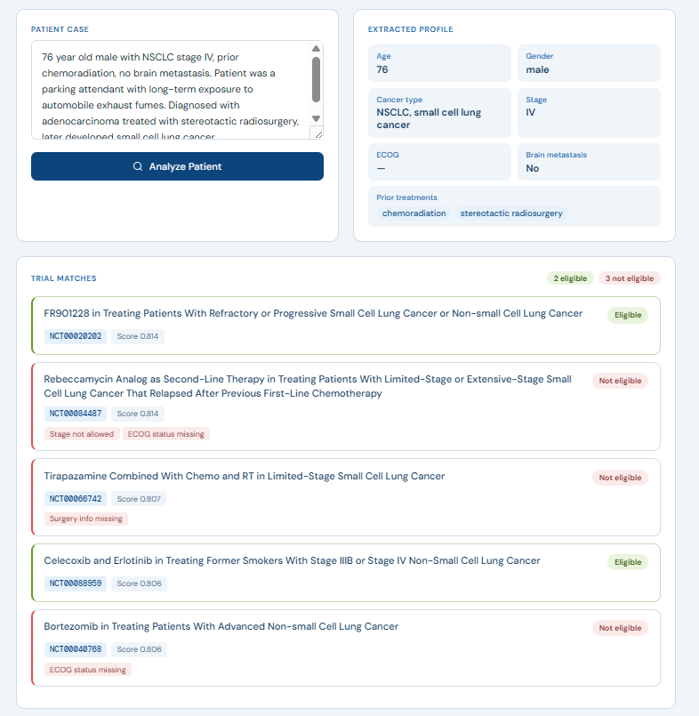

# Clinical Trial Matcher

Serbest metin hasta vakasından → uygun klinik trial bulan AI sistemi.



---

## Neden Bu Proje?

Clinical trial matching için klasik RAG yaklaşımı yanlış soruyu cevaplıyor.

RAG → "Hangi triallar bu hastayla alakalı?"
Doğru soru → "Bu hasta bu triala gerçekten uygun mu?"

İkisi çok farklı. LLM'e eligibility kararı verdirince tutarsız ve halüsinasyonlu sonuçlar çıkıyor. Çözüm: **LLM sadece çıkarım yapar, karar kod verir.**

---

## Mimari

```
Patient Text (free-text)
        ↓
  LLM (extraction only)
        ↓
  Structured Patient JSON
        ↓
  Semantic Search (Qdrant)
        ↓
  Rule Engine (deterministic Python)
        ↓
  Eligibility Decision + Failed Rules
```

### Üç aşama, üç sorumluluk:

| Aşama | Teknoloji | Ne yapar? |
|-------|-----------|-----------|
| Patient extraction | llama3:8b | Serbest metinden yapılandırılmış JSON çıkarır |
| Semantic retrieval | Qdrant + nomic-embed-text | 84k trial arasından ilgili adayları bulur |
| Eligibility matching | Saf Python | Deterministik kural motoru, karar verir |

---

## Stack

| Katman | Teknoloji |
|--------|-----------|
| LLM | llama3:8b via Ollama (local) |
| Embedding | nomic-embed-text (768 dim) |
| Vector DB | Qdrant (Docker) |
| Backend | FastAPI + Python 3.12 |
| Frontend | React + Vite |
| Data | ClinicalTrials.gov AllPublicXML |

Tamamen local. Sıfır harici API çağrısı.

---

## Kurulum

### Gereksinimler

- Python 3.12+
- Node.js 18+
- [Ollama](https://ollama.ai) 
- [Docker](https://docker.com)

### Backend

```bash
# 1) Qdrant başlat
docker run -p 6333:6333 qdrant/qdrant

# 2) Modelleri indir
ollama pull llama3:8b
ollama pull nomic-embed-text

# 3) Bağımlılıkları yükle
pip install -r requirements.txt

# 4) Trialleri indexle
python -m indexing.parse_trials

# 5) API'yi başlat
uvicorn api:app --reload
```

### Frontend

```bash
cd frontend
npm install
npm run dev
```

Tarayıcıda `http://localhost:5173` adresinde açılır.

---

## API Kullanımı

```bash
curl -X POST http://localhost:8000/analyze-patient \
  -H "Content-Type: application/json" \
  -d '{"text": "76 year old male with NSCLC stage IV, prior chemoradiation, no brain metastasis"}'
```

### Örnek yanıt

```json
{
  "patient": {
    "age": 76,
    "gender": "male",
    "cancer_type": ["nsclc"],
    "stage": "IV",
    "ecog": null,
    "mutations": [],
    "treatments": ["stereotactic radiosurgery", "chemoradiation"],
    "months_after_surgery": null,
    "brain_metastasis": false
  },
  "matches": [
    {
      "trial_id": 87781868643562,
      "nct_id": "NCT00003497",
      "score": 0.787,
      "title": "Antineoplaston Therapy in Treating Patients With Stage IV Non-Small Cell Lung Cancer",
      "decision": {
        "eligible": true,
        "failed_rules": []
      }
    },
    {
      "trial_id": 270353016178171,
      "nct_id": "NCT00084981",
      "score": 0.784,
      "title": "Decitabine and Valproic Acid in Treating Patients With Non-Small Cell Lung Cancer",
      "decision": {
        "eligible": false,
        "failed_rules": ["Surgery info missing", "ECOG status missing"]
      }
    }
  ]
}
```

---

## Proje Yapısı

```
config.py                         # tüm ayarlar tek yerde
api.py                            # FastAPI endpoint
frontend/                         # React + Vite UI
    src/
        App.jsx
        main.jsx
        index.css
pipeline/
    utils.py                      # shared JSON parser
    embed.py                      # hasta embedding
    matcher.py                    # deterministic rule engine
    semantic_rules_match.py       # CLI test aracı
indexing/
    llm_utils.py                  # LLM wrapper
    parse_trials.py               # XML parser + paralel indexer
    index_trials_with_rules.py    # trial indexer + rule compiler
data/
    trials_xml/                   # ClinicalTrials.gov XML
```

---

## Tasarım Kararları

**Neden LLM karar vermiyor?**

Trial uygunluk kararını LLM'e bırakmak tutarsız sonuçlar üretiyor — aynı hasta, aynı trial, farklı cevap. LLM yalnızca yapılandırılmamış metinden veri çıkarmak için kullanılıyor. Karar deterministik kural motoru tarafından veriliyor.

**Neden rules Qdrant'a cache'leniyor?**

Her trial için LLM rule extraction bir kez çalışır ve payload'a yazılır. Sonraki sorgularda LLM çağrısı yok — sadece Python.

**Neden Qdrant?**

84.000 trial arasından semantik olarak ilgili olanları hızlıca bulmak için. Kural eşleştirmesi bu ön filtreleme üzerine çalışıyor.

---

## Veri Kaynağı

[ClinicalTrials.gov](https://clinicaltrials.gov) — AllPublicXML (~84.000 trial)
